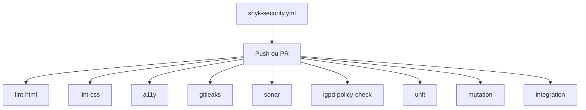

# Esteira de Desenvolvimento com IA

Documento-mãe do projeto **railanepassos.github.io** (`railanepassos.tec.br`). Toda mudança de código, conteúdo estrutural ou integração deve seguir este playbook.

**Stack alvo:** TypeScript + Node 20 (Vitest, Stryker, Playwright) quando houver código de aplicação. Enquanto o site for predominantemente estático, aplicam-se os gates marcados como *Onda 1*.

**Artefatos relacionados:**

| Artefato | Função |
|----------|--------|
| [AGENTS.md](AGENTS.md) | Regras para agentes de IA (Cursor, Copilot, Claude Code) |
| [docs/lgpd-checklist.md](docs/lgpd-checklist.md) | Checklist LGPD por feature |
| [.github/pull_request_template.md](.github/pull_request_template.md) | Checklist obrigatório em PRs |
| [.github/workflows/ci.yml](.github/workflows/ci.yml) | Pipeline principal |
| [.github/workflows/snyk-security.yml](.github/workflows/snyk-security.yml) | SAST (Snyk Code) |
| [.gitleaks.toml](.gitleaks.toml) | Detecção de segredos |

---

## 1. Princípios

1. **Spec primeiro** — toda mudança nasce de uma issue (feature ou bug) com critérios de aceite explícitos.
2. **TDD não negociável** — nenhum commit de produção sem teste correspondente (unitário, integração ou contrato, conforme o tipo de mudança).
3. **IA como copiloto** — agentes propõem diff; humano revisa e aprova. IA não faz merge em `main`.
4. **LGPD por design** — feature que toca dados pessoais exige [checklist LGPD](docs/lgpd-checklist.md) antes do código.
5. **Segurança contínua** — Snyk, SonarCloud e gitleaks em todo PR; revisão semanal agendada.
6. **Menor superfície** — sem scripts de terceiros desnecessários; CSP e recursos self-hosted quando possível.

---

## 2. Fluxo da feature (spec-driven com IA)

```mermaid
flowchart LR
    spec[Issue com spec] --> context[Context engineering AGENTS.md]
    context --> redTest[Teste vermelho]
    redTest --> aiDraft[IA gera implementacao]
    aiDraft --> greenTest[Testes verdes]
    greenTest --> mutation[Stryker mutacao]
    mutation --> security[Snyk Sonar gitleaks]
    security --> lgpdGate[Checklist LGPD]
    lgpdGate --> review[Review humano]
    review --> merge[Merge]
```



### Passos obrigatórios

| # | Passo | Responsável |
|---|--------|-------------|
| 1 | Abrir issue usando template (feature ou bug) | Humano |
| 2 | Preencher spec, ameaças de segurança e impacto LGPD | Humano + IA |
| 3 | Criar branch `feat/`, `fix/`, `chore/` ou `docs/` | Humano |
| 4 | Escrever teste(s) que falham (vermelho) | Humano ou IA sob supervisão |
| 5 | Implementar até testes verdes | IA + revisão humana |
| 6 | Rodar mutação (quando houver `package.json`) | CI |
| 7 | Abrir PR com template completo | Humano |
| 8 | Gates CI + Snyk + review | CI + humano |
| 9 | Merge em `main` | Humano (após aprovação) |

---

## 3. Disciplina TDD

### 3.1 Testes unitários (Vitest)

- **Quando:** módulos JS/TS (`src/`, `lib/`, scripts versionados).
- **Meta:** ≥ 80% linhas e ≥ 75% branches no escopo alterado do PR.
- **Comando local:** `npm run test:unit`
- **Onda 1:** job `unit` no CI é *skipped* até existir `package.json`.

### 3.2 Testes de mutação (Stryker)

- **Quando:** mesmo escopo dos unitários; obrigatório em PRs que alteram lógica.
- **Meta:** ≥ 70% mutation score no diff do PR; ≥ 60% global no repositório.
- **Comando local:** `npm run test:mutation`
- **Onda 1:** job `mutation` *skipped* até Onda 2.

### 3.3 Testes de integração (Playwright)

- **Smoke obrigatório (Onda 1):** `index.html`, `calendar.html`, `privacy-policy.html`
  - Páginas carregam sem erro HTTP 5xx
  - Links internos principais respondem
  - Meta CSP presente
  - Acessibilidade: axe via Pa11y (regra `color-contrast` temporariamente ignorada no CI até ajuste de paleta no hero; demais regras *critical*/*serious* bloqueiam)
- **Comando local (Onda 2+):** `npm run test:e2e`
- **Onda 1:** job `a11y` via Pa11y/axe em CI estático.

### 3.4 Testes de contrato

- **Quando:** surgir API, serverless ou integração externa versionada.
- **Ferramenta sugerida:** schemas Zod + diff em CI, ou Pact para consumidores/provedores.

### 3.5 Site estático (sem `package.json`)

| Tipo de mudança | Teste equivalente |
|-----------------|-------------------|
| HTML | `html-validate`, link check, CSP check no CI |
| CSS | `stylelint` |
| Conteúdo LGPD | checklist + job `lgpd-policy-check` |
| Assets | tamanho e tipo MIME no PR (revisão humana) |

---

## 4. Segurança e qualidade de código

| Ferramenta | Escopo | Workflow | Bloqueante |
|------------|--------|----------|------------|
| **Snyk Code** | SAST no repositório | [snyk-security.yml](.github/workflows/snyk-security.yml) | Sim (com `SNYK_TOKEN`) |
| **SonarCloud** | Qualidade, duplicação, hotspots | `ci.yml` → `sonar` | Sim (com `SONAR_TOKEN`) |
| **gitleaks** | Segredos em diff e histórico recente | `ci.yml` → `gitleaks` | Sim |
| **html-validate** | HTML semântico e válido | `ci.yml` → `lint-html` | Sim |
| **stylelint** | CSS | `ci.yml` → `lint-css` | Sim |
| **Dependabot** | Actions e npm (futuro) | [dependabot.yml](.github/dependabot.yml) | PRs automáticos |

### CSP e headers

Todo arquivo `.html` publicado deve manter a meta `Content-Security-Policy` definida no padrão do projeto. O job `lint-html` falha se a meta estiver ausente.

### Severidade

- Vulnerabilidades **high/critical** (Snyk/Sonar): bloqueiam merge até correção ou aceite documentado na issue.
- **Medium**: correção no mesmo PR ou issue filha com prazo na sprint.

---

## 5. LGPD em todo PR

Usar [docs/lgpd-checklist.md](docs/lgpd-checklist.md) e marcar itens no template de PR.

Resumo dos gatilhos de atualização em [privacy-policy.html](privacy-policy.html):

| Gatilho | Seção da política |
|---------|-------------------|
| Novo dado pessoal coletado | 3, 7 |
| Novo operador/terceiro | 4, 5 |
| Cookie, localStorage ou pixel | 6 |
| Nova finalidade | 3 |
| Decisão automatizada | 10 |
| Qualquer mudança material | bump em *Última atualização* |

**Job CI `lgpd-policy-check`:** se arquivos `*.html` (exceto só `privacy-policy.html`) mudaram no PR, exige label `lgpd-reviewed` ou menção `LGPD-OK` no corpo do PR.

---

## 6. Agentes de IA

Regras detalhadas em [AGENTS.md](AGENTS.md). Resumo:

- Ler `PLAYBOOK.md` e `AGENTS.md` antes de editar.
- Nunca pular fase vermelha do TDD.
- Não alterar `privacy-policy.html` sem checklist LGPD.
- Não fazer push em `main`; apenas PRs.
- Commits e PRs em linguagem profissional (sem modo caveman).

---

## 7. CI consolidado

Workflow: [.github/workflows/ci.yml](.github/workflows/ci.yml)



| Job | Onda | Condição de skip |
|-----|------|------------------|
| `lint-html` | 1 | nunca |
| `lint-css` | 1 | nunca |
| `a11y` | 1 | nunca |
| `gitleaks` | 1 | nunca |
| `lgpd-policy-check` | 1 | nunca |
| `sonar` | 1 | secret `SONAR_TOKEN` ausente → warning, não falha |
| `unit` | 2 | sem `package.json` |
| `mutation` | 2 | sem `package.json` ou não é PR |
| `integration` | 2 | sem `package.json` |

**Status checks recomendados na branch `main`:** `lint-html`, `lint-css`, `a11y`, `gitleaks`, `lgpd-policy-check`, `snyk-code` (workflow separado), `sonar` (quando configurado).

---

## 8. Estratégia de branches e commits

### Branches

| Prefixo | Uso |
|---------|-----|
| `feat/` | Nova funcionalidade |
| `fix/` | Correção de bug |
| `chore/` | CI, deps, tooling |
| `docs/` | Documentação e playbook |

### Commits (Conventional Commits)

```
<type>(<scope>): <subject>

[optional body]
```

Tipos: `feat`, `fix`, `docs`, `style`, `refactor`, `test`, `chore`, `ci`, `perf`, `build`.

Exemplos:

- `feat(hero): add CTA tracking module`
- `fix(perfil): correct crop for circular avatar`
- `ci(workflow): add gitleaks job`

### Proteção de `main`

- Require PR
- Require 1 approval
- Require status checks listados na seção 7
- Sem force-push
- Linear history (squash ou merge commit — definir preferência do time; padrão: squash)

---

## 9. Métricas e melhoria contínua

| Indicador | Meta | Fonte |
|-----------|------|-------|
| Cobertura unitária (linhas) | ≥ 80% | Vitest / Sonar |
| Cobertura branches | ≥ 75% | Vitest / Sonar |
| Mutation score (diff PR) | ≥ 70% | Stryker |
| Mutation score (global) | ≥ 60% | Stryker |
| Violações a11y critical/serious | 0 | axe / Pa11y no CI |
| Vulnerabilidades Snyk abertas (high+) | 0 | Snyk dashboard |
| Quality Gate Sonar | OK | SonarCloud |
| PRs sem checklist LGPD quando aplicável | 0 | Revisão + label |
| Dias desde último incidente LGPD | monitorar | Registro interno |

**Cadência:** revisão trimestral deste playbook (issue `chore/playbook-review-YYYY-QN`).

---

## 10. Roadmap incremental

### Onda 1 — Atual (site estático + esteira)

- [x] `PLAYBOOK.md`, `AGENTS.md`, templates GitHub
- [x] CI: lint HTML/CSS, a11y smoke, gitleaks, LGPD check
- [x] Snyk Code (workflow existente)
- [ ] SonarCloud configurado na conta (`SONAR_TOKEN`)
- [ ] Branch `main` protegida com status checks

### Onda 2 — JS/TS leve

- Adicionar `package.json`, Vitest, Stryker, Playwright
- Módulos em `src/` (ex.: analytics privacy-first, eventos de CTA)
- Ativar jobs `unit`, `mutation`, `integration` no CI
- Hooks locais: Husky + lint-staged + commitlint

### Onda 3 — Expansão

- Monorepo opcional (Turborepo): site + biblioteca/agente IA de QA
- Testes de contrato para APIs
- Pacote de prompts versionados para consultoria

---

## Pré-requisitos manuais (configuração única)

1. **GitHub Secret `SNYK_TOKEN`** — [snyk.io](https://snyk.io) → Account → General → Auth token
2. **GitHub Secret `SONAR_TOKEN`** — SonarCloud → My Account → Security → Generate token; criar projeto ligado ao repo
3. **Branch protection** — Settings → Branches → `main` → Require status checks
4. **Labels no repo** — criar label `lgpd-reviewed` (cor verde) para o gate LGPD

---

## Referências externas

- [LGPD — Lei 13.709/2018](https://www.planalto.gov.br/ccivil_03/_ato2015-2018/2018/lei/l13709.htm)
- [ANPD](https://www.gov.br/anpd/pt-br)
- [OWASP Top 10](https://owasp.org/www-project-top-ten/)
- [Conventional Commits](https://www.conventionalcommits.org/)
