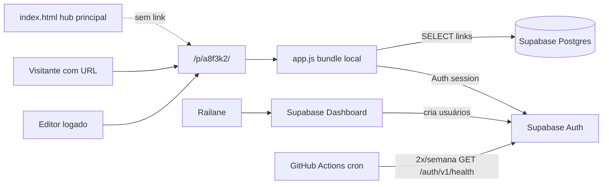

# Design: Admin de links em `/p/a8f3k2/` com Supabase

**Data:** 2026-07-11  
**Status:** Aprovado pelo titular (com reforço de página oculta)  
**Tipo:** `feat` — Onda 2 (primeiro `package.json` do repositório)

---

## 1. Objetivo

Permitir que editores autorizados gerenciem links externos (criar, editar, apagar, reordenar por arrastar) diretamente na página web, sem editar HTML nem abrir PR por link.

A página pública principal do site (`index.html`) **permanece inalterada** como hub de marca pessoal. A página de links administrável vive em URL obscura conhecida apenas por quem recebe o endereço.

---

## 2. Requisitos funcionais

| ID | Requisito |
|----|-----------|
| RF-01 | Visitante com o link `/p/a8f3k2/` vê lista de links (cards) carregada do Supabase |
| RF-02 | Editor logado vê painel para adicionar link (URL, título, descrição opcional, ícone) |
| RF-03 | Editor pode editar e apagar qualquer link |
| RF-04 | Editor pode reordenar links por drag-and-drop; ordem persiste em `sort_order` |
| RF-05 | Ícone: preset local (`/assets/icons/*.svg`) **ou** URL `https://` custom |
| RF-06 | Múltiplos editores; contas criadas **somente** pela controladora via Supabase Dashboard (signup público desligado) |
| RF-07 | Login por e-mail e senha (Supabase Auth) |
| RF-08 | `index.html` e demais páginas públicas **não** linkam para `/p/a8f3k2/` |

---

## 3. Requisitos não funcionais

| ID | Requisito |
|----|-----------|
| RNF-01 | Hospedagem continua em GitHub Pages (estático + JS bundle self-hosted) |
| RNF-02 | CSP estrita: sem CDN de scripts; `connect-src` apenas Supabase |
| RNF-03 | TDD: Vitest (unit) + Playwright (e2e smoke) conforme PLAYBOOK Onda 2 |
| RNF-04 | LGPD: atualizar `privacy-policy.html` + checklist + label `lgpd-reviewed` no PR |
| RNF-05 | Página **não indexada**: `noindex`, ausente do `sitemap.xml`, `Disallow` em `robots.txt`, sem links internos do site |
| RNF-06 | Acessibilidade: reorder com fallback teclado (↑/↓); axe/Pa11y no CI |
| RNF-07 | Keepalive Supabase: GitHub Actions ping **2×/semana**; falha = job vermelho + e-mail GitHub |

---

## 4. Descoberta e privacidade da URL

**Modelo:** segurança por obscuridade + `noindex` — **não** substitui autenticação para escrita.

Garantias no código e conteúdo:

- Nenhum `<a href="/p/a8f3k2/">` em `index.html`, `calendar.html`, `privacy-policy.html` ou footer global
- `/p/a8f3k2/` fora de `sitemap.xml` (já está)
- `robots.txt`: manter `Disallow: /p/a8f3k2/` (já está)
- Meta `robots`: manter `noindex, nofollow` em `p/a8f3k2/index.html`
- Não adicionar entrada em navegação, Open Graph público ou JSON-LD que exponha a rota

Quem não souber o path não encontra a página pelo site principal. Quem souber o path vê os links publicados (leitura pública intencional).

---

## 5. Arquitetura



### Stack

| Camada | Tecnologia |
|--------|------------|
| Hospedagem | GitHub Pages |
| Front admin + listagem | TypeScript, Vite → `p/a8f3k2/app.js` |
| Auth + DB | Supabase (Auth + Postgres + RLS) |
| Testes | Vitest, Playwright |
| CI | Jobs existentes + build + unit + e2e |

### Secrets (GitHub Actions)

| Secret | Uso |
|--------|-----|
| `SUPABASE_URL` | Injetado no build (`import.meta.env` / `config` gerado) |
| `SUPABASE_ANON_KEY` | Público por design; RLS protege writes; também usado no keepalive |

**Nunca** commitar `SUPABASE_SERVICE_ROLE_KEY`.

### Keepalive (free tier — evitar pausa por inatividade)

Supabase pausa projetos free após ~7 dias sem atividade na API. Mitigação:

| Item | Detalhe |
|------|---------|
| Workflow | `.github/workflows/supabase-keepalive.yml` |
| Frequência | **2×/semana** — segunda e quinta, 12:00 UTC (~09:00 BRT) |
| Endpoint | `GET {SUPABASE_URL}/auth/v1/health` (leve; não depende da tabela `links`) |
| Auth headers | `apikey` + `Authorization: Bearer` com anon key |
| Manual | `workflow_dispatch` para testar no Actions |
| Falha | `exit 1` → workflow vermelho → **e-mail GitHub** (se notificações de Actions ativas) |
| Redundância | Intervalo máx. ~3,5 dias entre pings; uma falha não cruza 7 dias se a outra passar |

**Configuração humana (fora do código):** GitHub → Settings → Notifications → Actions → habilitar falhas de workflow.

---

## 6. Modelo de dados

### Tabela `public.links`

| Coluna | Tipo | Notas |
|--------|------|-------|
| `id` | `uuid` | PK, `gen_random_uuid()` |
| `url` | `text` | NOT NULL; deve começar com `https://` |
| `label` | `text` | NOT NULL |
| `description` | `text` | NULL |
| `icon_preset` | `text` | NULL; valores: `instagram`, `github`, `linkedin`, `youtube`, `external-link`, `arrow-left` |
| `icon_url` | `text` | NULL; `https://` se preenchido |
| `sort_order` | `integer` | NOT NULL; único por lista |
| `created_by` | `uuid` | FK `auth.users(id)` |
| `created_at` | `timestamptz` | default `now()` |
| `updated_at` | `timestamptz` | trigger `updated_at` |

**Regra de ícone:** se `icon_url` preenchido, usa URL; senão se `icon_preset` preenchido, usa `/assets/icons/{preset}.svg`; senão fallback `external-link`.

**Constraint:** `icon_preset` e `icon_url` não precisam ser exclusivos, mas UI prioriza `icon_url` > `icon_preset` > default.

### RLS

| Operação | Política |
|----------|----------|
| `SELECT` | `true` para `anon` e `authenticated` (leitura pública na URL secreta) |
| `INSERT` | `authenticated` apenas |
| `UPDATE` | `authenticated` apenas |
| `DELETE` | `authenticated` apenas |

Signup desabilitado no Supabase → apenas usuários criados manualmente existem em `authenticated`.

### Seed

Migrar link existente:

- URL: `https://www.instagram.com/museudomar.aleixobelov/`
- Label: Museu do Mar
- Description: Aleixobelov, AL
- icon_preset: `instagram`
- sort_order: `0`

Script SQL em `supabase/migrations/001_links.sql` (versionado no repo).

---

## 7. Interface (`p/a8f3k2/index.html`)

### Estados

1. **Carregando** — skeleton ou mensagem neutra
2. **Lista pública** — `<nav class="sub-list">` preenchido via JS (mesmas classes CSS atuais)
3. **Não autenticado** — botão discreto “Entrar” → modal e-mail/senha
4. **Autenticado** — toolbar: “Novo link”, “Sair”; cards com handles de drag, editar, apagar; formulário inline ou modal

### Drag-and-drop

- HTML5 DnD nativo (sem dependência CDN)
- Ao soltar: recalcular `sort_order` e `UPDATE` em batch
- Fallback a11y: botões “Mover para cima” / “Mover para baixo” por item

### CSP atualizada (meta tag)

```
default-src 'self';
style-src 'self';
img-src 'self' https: data:;
font-src 'self';
connect-src 'self' https://*.supabase.co;
base-uri 'self';
form-action 'none';
frame-ancestors 'none';
script-src 'self';
upgrade-insecure-requests
```

`index.html` adiciona `<script src="app.js" defer></script>` (caminho relativo ou `/p/a8f3k2/app.js`).

---

## 8. Estrutura de arquivos (proposta)

```
package.json
vite.config.ts
tsconfig.json
src/links/
  main.ts           # bootstrap
  auth.ts           # login/logout/session
  links-repo.ts     # Supabase CRUD + reorder
  render.ts         # DOM link cards
  admin-ui.ts       # forms, drag, modals
  icons.ts          # resolve preset vs custom URL
  validate.ts       # URL validation
supabase/migrations/001_links.sql
p/a8f3k2/
  index.html        # shell + CSP + script tag
  app.js            # build output (gitignored ou commitado — ver nota)
tests/unit/
tests/e2e/
```

**Nota build:** Para GitHub Pages sem workflow de build no deploy, o CI deve gerar `app.js` no PR e o artefato é commitado **ou** um workflow `pages-build` roda build antes do deploy. Recomendação: workflow `deploy` que builda e publica (GitHub Actions Pages) — detalhar no plano de implementação.

---

## 9. Testes

| Tipo | Escopo |
|------|--------|
| Unit (Vitest) | `validate.ts`, `icons.ts`, ordenação após reorder |
| E2e (Playwright) | Página carrega; lista renderiza (mock Supabase ou projeto test); login UI visível; sem regressão a11y |
| CI estático | `html-validate`, stylelint, Pa11y em `/p/a8f3k2/` |

---

## 10. LGPD

| Dado | Coletado no domínio? | Operador |
|------|----------------------|----------|
| E-mail/senha no login | Enviado ao Supabase Auth | Supabase |
| Sessão (JWT) | `localStorage` | Navegador + Supabase |
| IP em requests | Logs Supabase | Supabase (EUA) |

Atualizar `privacy-policy.html`:

- §3 — finalidade login de editores
- §4–§5 — Supabase como operador; transferência internacional
- §6 — `localStorage` para sessão
- Bump “Última atualização”

PR: label `lgpd-reviewed` ou `LGPD-OK` no corpo.

---

## 11. Fora de escopo (v1)

- Auto-registro de usuários
- Papéis distintos (admin vs editor) — todos os autenticados têm CRUD completo
- Upload de ícone para storage (apenas URL ou preset)
- Link da página secreta no `index.html`
- Alterar layout ou conteúdo do hub principal

---

## 12. Critérios de aceite

- [ ] `index.html` não referencia `/p/a8f3k2/`
- [ ] Visitante com URL vê links do Supabase
- [ ] Editor logado faz CRUD + reorder persistido
- [ ] Signup público desabilitado; usuário de teste criado no dashboard funciona
- [ ] CSP passa no CI; sem scripts de terceiros
- [ ] Vitest + Playwright verdes no CI
- [ ] `privacy-policy.html` atualizada; gate LGPD satisfeito
- [ ] Pa11y sem violações critical/serious novas
- [ ] Workflow keepalive roda 2×/semana; ping manual (`workflow_dispatch`) passa
- [ ] Falha simulada (secret inválido) gera job vermelho e notificação por e-mail

---

## 13. Decisões registradas

| Decisão | Escolha |
|---------|---------|
| Backend | Supabase |
| Contas | Multi-editor; criação só pela controladora |
| Ícones | Preset + URL custom |
| Página principal | Inalterada; sem links para rota secreta |
| Descoberta | URL digitada + noindex + robots + fora do sitemap |
| Keepalive | GitHub Actions 2×/semana + alerta por falha no Actions |
